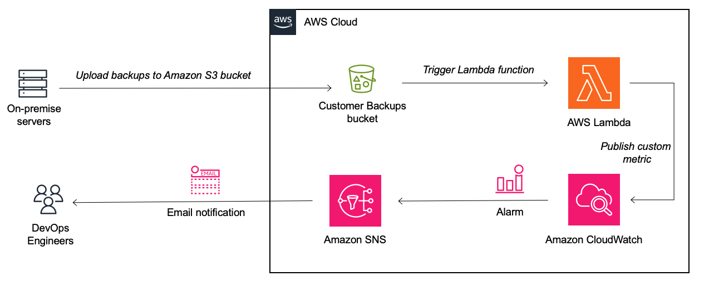

# Build Amazon CloudWatch dashboards and alarms to monitor backups to Amazon S3

Amazon S3 offers industry-leading scalability and availability, and customers often use Amazon S3 as a backup target, for data from on-premise systems, including Linux or Windows servers. Usually, the AWS CLI is used in a script to copy these backups to Amazon S3. Customers may struggle to ensure that these backups are successful, and if they fail, to notify teams to resolve the issue.  Amazon S3 Event Notifications provides a mechanism for initiating events when backups land in an S3 bucket. 

In this pattern, we will create an Amazon S3 trigger to invoke a Lambda function that will publish a custom metric to Amazon CloudWatch, based on the backup data in S3. CloudWatch dashboards will allow you to monitor all backups in a single graph, and CloudWatch alarms will send notifications when backups fail, to help customers quickly resolve failing backups. 

This pattern uses AWS serverless services to implement an event-driven approach to monitor backup files in Amazon S3.

## Prerequisites 

- An active AWS account.

- AWS Command Line Interface (AWS CLI), installed and configured to work with the AWS account, on one or multiple systems/servers that are backing up to Amazon S3, with an IAM user that has access to the Amazon S3 bucket.

- AWS Serverless Application Model Command Line Interface (AWS SAM CLI) installed, in order to deploy this architecture

## Assumptions 

You can choose how to structure your backup data in the Amazon S3 bucket, based on your current setup. The default behaviour of the Lambda function assumes that in the root of the bucket, there will be folders that hold backup data for different types of applications, locations, customers, or any other structure you want to monitor. E.g. lets say you have three different types of applications that you are backing up data for: a web application, a CRM application, and a database. In this case, each application will be backed up to three different folders in the same bucket, namely:

- web
- crm
- db

Or they could be for systems in different locations, and then the different folders could be:

- johannesburg
- capetown

Assuming these systems run on on-premise servers, or even on Amazon EC2 instances, once you have created the backups, some script on each of those servers could use (probably scheduled from cron to run daily or at some other regular internal) the following AWS CLI S3 command to copy the backup files to the bucket:

`aws s3 cp /web/backup-2023-09-14.tar.gz s3://myuniquebucket/web/backup-2023-09-14.tar.gz`

`aws s3 cp /crm/backup-2023-09-14.tar.gz s3://myuniquebucket/crm/backup-2023-09-14.tar.gz`

This line below in the AWS Lambda function determines the folder name, which is the metric we will measure in CloudWatch. This can be customised based on the file or directory structure of your backup date.

`metric_name = filename.split("/")[0]`

## Architecture

- Amazon S3 bucket
- Amazon Lambda
- Amazon CloudWatch
- Amazon SNS



## Automation and scale

AWS Serverless Application Model (AWS SAM) is an open-source framework that helps you build serverless applications in the AWS Cloud. AWS SAM will deploy and build the S3 bucket, with a trigger to the Lambda function, as well as an SNS topic to send email alerts

## Best practices

Event driven programs use events to initiate succeeding steps in a process. For example, the completion of an upload job may then initiate an image processing job. This allows developers to create complex architectures by using the principle of decoupling. Decoupling is preferable for many workflows, as it allows each component to perform its tasks independently, which improves efficiency. Examples are ecommerce order processing, image processing, and other long running batch jobs.

Amazon Simple Storage Service (S3) is an object-based storage solution from Amazon Web Services (AWS) that allows you to store and retrieve any amount of data, at any scale. Amazon S3 Event Notifications provides users a mechanism for initiating events when certain actions take place inside an S3 bucket.

Using AWS serverless services to implement event-driven approach will allow you to build scalable, fault tolerant applications. AWS Lambda is a serverless, event-driven compute service that lets you run code for virtually any type of application or backend service without provisioning or managing servers. You can use Lambda to process event notifications from Amazon Simple Storage Service. Amazon S3 can send an event to a Lambda function when an object is created or deleted.

## Deploy using AWS SAM
### Clone the repo
You can use the AWS Cloud9 IDE or any another IDE (for example, Visual Studio Code or IntelliJ IDEA) for this pattern.

Run the following command to clone the application's repository into your IDE:
`git clone https://github.com/aws-samples/monitor-backups-to-amazon-s3-using-amazon-cloudwatch/`

and change to that directory:
`cd monitor-backups-to-amazon-s3-using-amazon-cloudwatch/`

### Deploy to AWS using AWS SAM
Now that the application is configured with our Amazon S3 bucket name and email address for Amazon SNS notifications, we can proceed to deploy the application using AWS SAM.

To build and deploy this application for the first time, run the following in your shell:
```
sam build
sam deploy --guided
```

The first command will build the source of your application. The second command will package and deploy your application to AWS, with a series of prompts:

- Stack Name: The name of the stack to deploy to CloudFormation. This should be unique to your account and region, and a good starting point would be something matching your project name.
- AWS Region: The AWS region you want to deploy your app to.
- Parameter MyBucket: Please specify a name of a new S3 bucket you want created. Please note the S3 bucket naming rules. 
- Parameter MyEmailAddress: Please specify an email address in order to receive email notifications of failed backups to Amazon S3.
- Confirm changes before deploy: If set to yes, any change sets will be shown to you before execution for manual review. If set to no, the AWS SAM CLI will automatically deploy application changes.
- Allow SAM CLI IAM role creation: Many AWS SAM templates, including this example, create AWS IAM roles required for the AWS Lambda function(s) included to access AWS services. By default, these are scoped down to minimum required permissions. 
- Save arguments to samconfig.toml: If set to yes, your choices will be saved to a configuration file inside the project, so that in the future you can just re-run sam deploy without parameters to deploy changes to your application.

For future deploys, you can just run:

`sam build && sam deploy`

This will result in the creation of the following AWS resources:

- Amazon S3 bucket
- Amazon S3 event notification trigger to a Lambda function
- AWS Lambda function that receives an event each time an object is created in Amazon S3, and based on the filename, creates a custom metric in Amazon CloudWatch that tracks the count of uploads
- Amazon SNS Topic and subscription with the specified email address, that will be later used by an Amazon CloudWatch alarm to send notifications when the metric of uploads is breached, which is the result of no uploads to Amazon S3.

## Backup and upload data to Amazon S3
Now that the Amazon S3 bucket and Lambda function have been created, we can now upload our backup data to the bucket. This will then trigger the Lambda function, which will create custom metrics in Amazon CloudWatch, which need to configure the Amazon CloudWatch dashboards and alerts. 

You could use the following AWS CLI S3 command to copy backup files to the bucket (use your own bucket name):

`aws s3 cp /web/backup-2023-09-14.tar.gz s3://myuniquebucket/web/backup-2023-09-14.tar.gz`

`aws s3 cp /crm/backup-2023-09-14.tar.gz s3://myuniquebucket/crm/backup-2023-09-14.tar.gz`

Once these objects land in Amazon S3, the AWS Lambda function will publish a custom metric in Amazon CloudWatch for each folder that has data uploaded to it.

## Configure CloudWatch dashboards and alerts
### Create a CloudWatch dashboard
To create a CloudWatch dashboard in the same region you have been using throughout this pattern, please follow this guide from the AWS documentation. You can choose any name for the dashboard.
### Add a CloudWatch widget to visualise the custom metric
When we uploaded data to the Amazon S3 bucket, the AWS Lambda function created custom metrics for each folder, under a namespace called BackupsMonitoring, which was based on different types of applications we are storing backup data for. We can now add it to the dashboard to visualise it using widgets and graphs - we will be following this AWS documentation guide.

1. In the same dashboard that was created above, Choose the + symbol on the top right.
2. Choose the Line widget, using Metrics, then choose Next.
3. Under Custom namespaces, choose BackupsMonitoring, then select service
4. Here you will find many custom metrics, based on how many backup files you uploaded in the previous epic. Assuming you uploaded different backups each to the web, crm and db folders, you will find each one listed here. Select the tick box for the ones you want to add to the graph.
5. Change the Statistics to Sum, and Period to 1 day. This will now sum up each metric count, based on on our backup schedule, where we expect backups to upload to S3 once a day.
6. Optionally, after adding all the metrics, select Add math, under All functions, select FILL. This will add a new Label, with Details of FILL(METRICS(), 0), which will connect the different data points.
7. Click Create Widget.
8. Click Save on the dashboard.

You now have a graph that visualises the backups to Amazon S3 on the dashboard you created.

### Create a CloudWatch alarm to alert on backup failures
We want Amazon CloudWatch to alert us when backups are not copied regularly to the Amazon S3 Bucket. To do this, we will create an Amazon CloudWatch alarm to monitor the custom metrics we created earlier.

We will be following this AWS documentation guide.

1. In Amazon CloudWatch, on the left vertical navigation bar, choose Alarms, All alarms.
2. On the top right, click Create alarm
3. Choose Select Metric.
4. Choose BackupsMonitoring, then service.
5. Assuming you already uploaded some backup data to folders name crm or web, you will see these listed here as metrics. Select the tick box next to the metric you want, then click Select Metric. You may only select a single metric at a time, so if there were multiple metrics you wanted to create an alarm for, this process will be repeated per metric.
6. Change Statistic to Sum, and Period to 1 day, or any other period based on your backup schedule.
7. Change Threshold type to Static.
8. Change the alarm condition to Lower, and threshold value to 1.
9. Under Additional configuration, change Missing data treatment to Treat missing data as bad (breaching threshold).
10. Select Next.
11. Select an existing SNS topic, and choose the one that starts with backupmonitoring-s3tocloudwatch-custommetrics-SNSTopic-. Your email address will appear.
12. Select Next.
13. Choose an alarm name of your choice, then Select Next.
14. In the Preview screen, verify the following:
- service: BackupsMonitoring
- Statistic: Sum
- Period: 1 day
- Threshold type: Static
- Whenever: Lower (<)
- than: 1
- Missing data treatment: Treat missing data as bad (breaching threshold)
15. Click Create alarm.

Repeat the above for all metrics you want to create alarms for. You will now receive an email from Amazon SNS whenever backup data from this system is not copied to Amazon S3 at least once a day. 

## Related resources
### References

- Install or update the latest version of the AWS CLI (AWS AWS Command Line Interface documentation)
- Configure the AWS CLI (AWS AWS Command Line Interface documentation)
- Installing the AWS SAM CLI (AWS Serverless Application Model documentation)
- Creating a CloudWatch dashboard (Amazon CloudWatch documentation)
- Add or remove a graph from a CloudWatch dashboard (Amazon CloudWatch documentation)
- Create a CloudWatch alarm based on a static threshold (Amazon CloudWatch documentation)

### Workshops

Amazon CloudWatch workshop

## Additional information
There are multiple ways to backup data to AWS from on-premise systems to AWS storage services like Amazon S3:

- Many third-party backup services have built-in cloud connectors that can be enabled to send data backups to AWS without disruption to your organization's daily operations.
- AWS Storage Gateway is a hybrid storage service that enables your on-premises applications to seamlessly use AWS cloud storage.
- AWS DataSync is a secure, online service that automates and accelerates moving data between on premises and AWS storage services
- AWS Snow Family are purpose-built devices to cost effectively move petabytes of data, offline.
- AWS Command Line Interface (AWS CLI) is an open source tool that enables you to interact with AWS services from multiple supported operating systems
- Mountpoint for Amazon S3 is an open source file client that you can use to mount an S3 bucket on your compute instance and access it as a local file system.

## Security

See [CONTRIBUTING](CONTRIBUTING.md#security-issue-notifications) for more information.

## License

This library is licensed under the MIT-0 License. See the LICENSE file.

