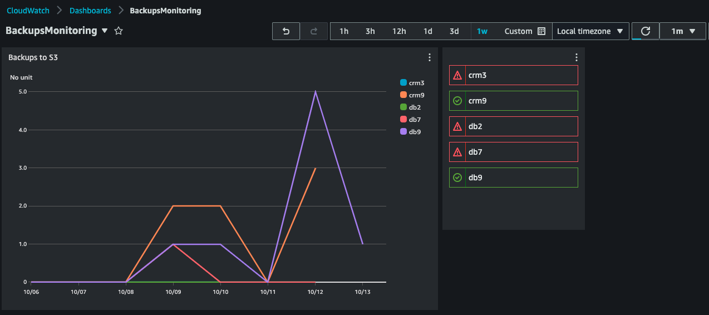
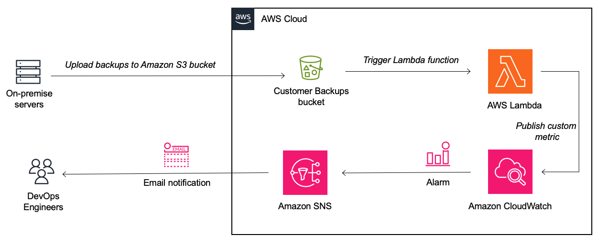

# Build Amazon CloudWatch dashboards and alarms to monitor backups to Amazon S3

Amazon S3 offers industry-leading scalability and availability, and customers often use Amazon S3 as a backup target, for data from on-premise systems, including Linux or Windows servers. Usually, the AWS CLI is used in a script to copy/upload these backups to Amazon S3. Customers may struggle to ensure that these backup uploads are successful, and if they fail, to notify teams to resolve the issue.  [Amazon S3 Event Notifications](https://docs.aws.amazon.com/AmazonS3/latest/userguide/NotificationHowTo.html) provides a mechanism for initiating events when backups land in an S3 bucket. 

This pattern uses AWS serverless services to implement an event-driven approach to monitor backup files ([objects](https://docs.aws.amazon.com/AmazonS3/latest/userguide/UsingObjects.html))  in Amazon S3. It will create an Amazon S3 trigger to invoke a Lambda function when backups are copied into the Amazon S3 bucket, that will publish a custom metric to Amazon CloudWatch, based on the backup data in Amazon S3. Amazon CloudWatch dashboards will allow customers to monitor all backups in a single graph, and CloudWatch alarms will send notifications when backup uploads to Amazon S3 fail, to help customers quickly resolve failing backups. This pattern will create a CloudWatch dashboard like this:



## Prerequisites 

- An active AWS account
- AWS Command Line Interface (AWS CLI) [installed](https://docs.aws.amazon.com/cli/latest/userguide/getting-started-install.html) and [configured](https://docs.aws.amazon.com/cli/latest/userguide/cli-chap-configure.html) to work with the AWS account, on one or multiple systems/servers that are backing up to Amazon S3. Or you can use [other methods to backup data to Amazon S3](https://aws.amazon.com/backup-restore/use-cases/)
- AWS Serverless Application Model Command Line Interface (AWS SAM CLI) [installed](https://docs.aws.amazon.com/serverless-application-model/latest/developerguide/install-sam-cli.html)
- Python 3 [installed](https://www.python.org/downloads/)

## Assumptions 

You can choose how to structure your backup data in the Amazon S3 bucket, based on your current setup. The default behaviour of the Lambda function assumes that in the root of the bucket, there will be folders ([Amazon S3 prefixes](https://docs.aws.amazon.com/AmazonS3/latest/userguide/using-prefixes.html)) that hold backup data for different types of systems, applications, locations, customers, or any other structure you want to monitor. E.g. lets say you have three different types of applications that you are backing up data for: a web application, a CRM application, and a database. In this case, each application will be backed up to three different folders in the same bucket, namely:

    - web
    - crm
    - db

Or they could be for systems in different locations, and then the different folders could be:

    - johannesburg
    - capetown

Assuming these systems run on on-premise servers, or even on Amazon EC2 instances, once you have created the backups, some script on each of those servers could use (probably scheduled from cron to run daily or at some other regular internal) the [AWS CLI S3 copy command](https://awscli.amazonaws.com/v2/documentation/api/latest/reference/s3/cp.html) to copy the backup files to the bucket: (Note: you must edit the placeholders )

`aws s3 cp {source backup files} s3://{MyBucket}/{system}/`

Some examples could be:

    aws s3 cp /web/backup-2023-09-14.tar.gz s3://myuniquebucket/web/ --storage-class DEEP_ARCHIVE

    aws s3 cp /crm/backup-2023-09-14.tar.gz s3://myuniquebucket/crm/ --storage-class DEEP_ARCHIVE

This line below in the [AWS Lambda CustomMetrics function](https://github.com/aws-samples/monitor-backups-to-amazon-s3-using-amazon-cloudwatch/blob/main/monitor/metrics.py) determines the folder name, which is the metric we will monitor in CloudWatch. 

`metric_name = filename.split("/")[0]`

That assumes that the root of the S3 bucket contains the folders with the backups files, like this:
```
S3Bucket
   ├── crm
   ├── db
   └── web
```

This can be customised based on the file or directory structure of your backup data. So if your backup data folders for each system are not in the root of the S3 bucket, like this:
```
S3Bucket
└── Applications
    ├── crm
    ├── db
    └── web
```
then changing the line below would make sure that the `Applications` folder is ignored, and metrics are created for the system folders:

`metric_name = filename.split("/")[1]`


## Architecture

- Amazon S3 bucket
- Amazon Lambda
- Amazon CloudWatch
- Amazon SNS




## Deploy using AWS SAM
Follow these steps to deploy this pattern.

### Clone the repo
You can use any terminal, the [AWS Cloud9 IDE](https://aws.amazon.com/cloud9/), or any another IDE (for example, Visual Studio Code or IntelliJ IDEA) for this pattern.

Run the following command to clone the application's repository into your IDE:

`git clone https://github.com/aws-samples/monitor-backups-to-amazon-s3-using-amazon-cloudwatch/`

and change to that directory:

`cd monitor-backups-to-amazon-s3-using-amazon-cloudwatch/`

### Deploy to AWS using AWS SAM
To build and deploy this application for the first time, run the following in your shell:
```
sam build
sam deploy --guided
```

The first command will build the source of your application. The second command will package and deploy your application to AWS, with a series of prompts:

- **Stack Name**: The name of the stack to deploy to CloudFormation. This should be unique to your account and region, and a good starting point would be something matching your project name.
- **AWS Region**: The AWS region you want to deploy your app to.
- Parameter **CreateBucket**: Should this SAM template create a new Amazon S3 bucket, or does your bucket already exist? Please use 'create' to create a new S3 bucket, or 'reuse' to re-use an existing bucket. The default is 'create'.
- Parameter **MyBucket**: Please specify a name of a new S3 bucket you want created. Must not be an existing bucket, and the name must be globally unique. Please note the [S3 bucket naming rules](https://docs.aws.amazon.com/AmazonS3/latest/userguide/bucketnamingrules.html). 
- Parameter **MyEmailAddress**: Please specify an email address in order to receive email notifications of failed backups to Amazon S3.
- Parameter **MetricName** [Backups]: The name of the CloudWatch metric that should be used. Can be any string. The default is "Backups".
- Parameter **DimensionName** [System]: The name of the CloudWatch dimension that should be used for the above metric, based on what each S3 folder represents. E.g each folder can represent a System, Location, or Customer, that you doing backups for. Can be any string. The default is "System".
- Parameter **BackupFrequencyPeriod** [86400]: What schedule/frequency does your backups run, e.g. Hourly, daily, weekly? The value must be represented in seconds. The default is 86400 seconds = 1 day, i.e. you expect that files are backed up to S3 daily.
- Confirm changes before deploy: If set to yes, any change sets will be shown to you before execution for manual review. If set to no, the AWS SAM CLI will automatically deploy application changes.
- Allow SAM CLI IAM role creation: Many AWS SAM templates, including this example, create AWS IAM roles required for the AWS Lambda function(s) included to access AWS services. By default, these are scoped down to minimum required permissions. 
- Save arguments to samconfig.toml: If set to yes, your choices will be saved to a configuration file inside the project, so that in the future you can just re-run sam deploy without parameters to deploy changes to your application.

For future deploys, you can just run:

`sam build && sam deploy`

This will result in the creation of the following AWS resources:

- Amazon S3 bucket (or link to an existing bucket if specified)
- Amazon S3 event notification trigger to a Lambda function
- AWS Lambda function named `CustomMetricsFunction` that receives an event each time an object is created in Amazon S3, and based on the path/folder, creates a custom metric in Amazon CloudWatch that tracks the count of uploads
- A second AWS Lambda function named `AlarmsFunction` that runs on a daily schedule to create CloudWatch alarms for each metric
- Optionally, a third AWS Lambda function named `HelperS3NotifcationFunction` that is only deployed if an existing S3 bucket is used. This function will create an [S3 Notification](https://docs.aws.amazon.com/AmazonS3/latest/userguide/EventNotifications.html) between the existing bucket and `CustomMetricsFunction` 
- Amazon CloudWatch dashboard, with a graph for each metric, and a corresponding alarm
- Amazon SNS Topic and subscription with the specified email address, that will be later used by an Amazon CloudWatch alarm to send notifications when the metric of uploads is breached, which is the result of no uploads to Amazon S3
- [Amazon EventBridge Scheduler](https://aws.amazon.com/eventbridge/scheduler/) that will run `AlarmsFunction` on a regular schedule.

## Backup and upload data to Amazon S3
Now that the Amazon S3 bucket and Lambda function have been created, we can now upload our backup data to the bucket. This will then trigger the **CustomMetricsFunction**, which will create custom metrics in Amazon CloudWatch.

You could use the following [AWS CLI S3 copy command](https://awscli.amazonaws.com/v2/documentation/api/latest/reference/s3/cp.html) to copy the backup files to the bucket: (Note: you must edit the placeholders)

`aws s3 cp {source backup files} s3://{MyBucket}/{system}/`

or using [sync:](https://awscli.amazonaws.com/v2/documentation/api/latest/reference/s3/sync.html)

`aws s3 sync . s3://{MyBucket}/{system}`

Some examples could be, where you upload backups for 'web' and 'crm', to the [Amazon S3 Glacier Deep Archive storage class](https://aws.amazon.com/s3/storage-classes/glacier/)

`aws s3 cp /web/backup-2023-09-14.tar.gz s3://myuniquebucket/web/ --storage-class DEEP_ARCHIVE`

`aws s3 cp /crm/backup-2023-09-14.tar.gz s3://myuniquebucket/crm/ --storage-class DEEP_ARCHIVE`

Once these objects land in Amazon S3, the AWS Lambda function will publish a custom metric in Amazon CloudWatch for each folder that has data uploaded to it.

## Verify CloudWatch dashboards and alerts

### Confirm SNS Subscription
Amazon SNS will send a subscription confirmation message to the email addressed you used. Please click on this link in the email to confirm the subscription. Amazon CloudWatch alarms will not be able to send emails via Amazon SNS until the subscription has been confirmed. 

### Verify CloudWatch dashboard
The SAM template deployed an Amazon CloudWatch dashboard named `BackupsMonitoring`. You can navigate to [CloudWatch in the management console](https://console.aws.amazon.com/cloudwatch/home#dashboards/), and [select the BackupsMonitoring dashboard](https://console.aws.amazon.com/cloudwatch/home#dashboards/dashboard/BackupsMonitoring).

You will find a graph with data points for your backup data. Assuming you uploaded backup data for `web` and `crm`, you will find these on the legend of the graph. You may customise the timeline on the top right.

You can follow [this AWS documentation guide](https://docs.aws.amazon.com/AmazonCloudWatch/latest/monitoring/add_remove_graph_dashboard.html) in order to add more graphs.


### Verify CloudWatch alarms to alert on backup failures
We want Amazon CloudWatch to alert us when backups are not copied regularly to the Amazon S3 Bucket. To do this, we can use the 2nd AWS Lambda function named `AlarmsFunction` that will create alarms for each metric created above. You can wait for the `AlarmsFunction` to run on a schedule once a day, or you can [manually invoke it](https://docs.aws.amazon.com/serverless-application-model/latest/developerguide/using-sam-cli-remote-invoke.html), with the correct stack name you chose when running the `sam deploy --guided` command earlier: 

`sam remote invoke --stack-name {my-stack-name} AlarmsFunction`

and the output will indicate which alarms have been created:

```
Invoking Lambda Function AlarmsFunction                                                                                                                                                                       
{"level":"INFO","location":"create_metric_alarm:16","message":"Creating CloudWatch Alarm for: web","timestamp":"2023-10-13 15:43:16,834+0000","service":"service_undefined","xray_trace_id":"1-65296593-7d1f7a55420145f345ca779e"}
{"level":"INFO","location":"create_metric_alarm:16","message":"Creating CloudWatch Alarm for: crm",
REPORT RequestId: e8ad25b2-9a2c-4c1d-b6fa-5a37b6e61fb1  Duration: 4104.72 ms    Billed Duration: 4105 ms        Memory Size: 128 MB     Max Memory Used: 75 MB  Init Duration: 372.69 ms
```

You can follow this [AWS documentation guide](https://docs.aws.amazon.com/AmazonCloudWatch/latest/monitoring/ConsoleAlarms.html) to create additional CloudWatch alarms.

You will now receive an email from Amazon SNS whenever backup data from this system is not copied to Amazon S3 at least once a day. 

## Troubleshooting
### CustomMetricsFunction not been invoked on each file uploaded to S3
The AWS Lambda `CustomMetricsFunction` needs to be invoked each time a backup file is uploaded to the Amazon S3 bucket. If you are re-using your existing S3 bucket, the `HelperS3NotifcationFunction` was supposed to create the [S3 Event Notification](https://docs.aws.amazon.com/AmazonS3/latest/userguide/enable-event-notifications.html) between the S3 bucket and the `CustomMetricsFunction`. You can [manually create the S3 Event Notification](https://docs.aws.amazon.com/lambda/latest/dg/with-s3-example.html), or [check this out](https://repost.aws/knowledge-center/lambda-configure-s3-event-notification).


### Metrics not created per backup folder
If metrics have not been created on the CloudWatch dashboard for each of the backup folders, you can view the AWS Lambda **CustomMetricsFunctions** logs to identify the problem.
You can view the AWS Lambda logs in a number of ways:
- using the AWS SAM CLI, with the correct stack name you chose when running the `sam deploy --guided` command earlier, [this command will show the AWS Lambda logs](https://docs.aws.amazon.com/serverless-application-model/latest/developerguide/sam-cli-command-reference-sam-logs.html):

    `sam logs --stack-name {my-stack-name}`
- using the [Lambda console](https://docs.aws.amazon.com/lambda/latest/dg/monitoring-cloudwatchlogs.html#monitoring-cloudwatchlogs-console) 

The logs will indicate that the **CustomMetricsFunctions** created a CloudWatch metric and dimension for a file uploaded to `s3://myuniquebucket/web/backup-2023-09-14.tar.gz`

```
2023/10/13/[$LATEST]fbd13160e9794b9da58305d2765ed9c6 2023-10-13T14:04:15.719000 INIT_START Runtime Version: python:3.11.v14     Runtime Version ARN: arn:aws:lambda:af-south-1::runtime:f718e534828938076c2b13386127506049c7b53188aace2667ca4ab835d5de40
2023/10/13/[$LATEST]fbd13160e9794b9da58305d2765ed9c6 2023-10-13T14:04:15.882000 START RequestId: cf95e553-6351-4798-98a3-e848d19629f2 Version: $LATEST
2023/10/13/[$LATEST]fbd13160e9794b9da58305d2765ed9c6 2023-10-13T14:04:15.883000 {
  "level": "INFO",
  "location": "lambda_handler:17",
  "message": "Start processing S3 Event",
  "timestamp": "2023-10-13 14:04:15,883+0000",
  "service": "service_undefined",
  "xray_trace_id": "1-65294e5f-57db9abf2318e4893da4107e"
}
2023/10/13/[$LATEST]fbd13160e9794b9da58305d2765ed9c6 2023-10-13T14:04:15.883000 {
  "level": "INFO",
  "location": "lambda_handler:20",
  "message": "Backup file: web/backup-2023-09-14.tar.gz",
  "timestamp": "2023-10-13 14:04:15,883+0000",
  "service": "service_undefined",
  "xray_trace_id": "1-65294e5f-57db9abf2318e4893da4107e"
}
2023/10/13/[$LATEST]fbd13160e9794b9da58305d2765ed9c6 2023-10-13T14:04:15.883000 {
  "level": "INFO",
  "location": "lambda_handler:27",
  "message": "Pushed metric and dimension for: web",
  "timestamp": "2023-10-13 14:04:15,883+0000",
  "service": "service_undefined",
  "xray_trace_id": "1-65294e5f-57db9abf2318e4893da4107e"
}
2023/10/13/[$LATEST]fbd13160e9794b9da58305d2765ed9c6 2023-10-13T14:04:15.883000 {
  "_aws": {
    "Timestamp": 1697205855883,
    "CloudWatchMetrics": [
      {
        "Namespace": "BackupsMonitoring",
        "Dimensions": [
          [
            "System"
          ]
        ],
        "Metrics": [
          {
            "Name": "Backups",
            "Unit": "Count"
          }
        ]
      }
    ]
  },
  "System": "web",
  "Backups": [
    1.0
  ]
}
2023/10/13/[$LATEST]fbd13160e9794b9da58305d2765ed9c6 2023-10-13T14:04:15.899000 END RequestId: cf95e553-6351-4798-98a3-e848d19629f2
2023/10/13/[$LATEST]fbd13160e9794b9da58305d2765ed9c6 2023-10-13T14:04:15.899000 REPORT RequestId: cf95e553-6351-4798-98a3-e848d19629f2  Duration: 16.83 ms      Billed Duration: 17 ms   Memory Size: 128 MB     Max Memory Used: 44 MB  Init Duration: 162.32 ms
```

## Estimated Costs
- [S3 Pricing](https://aws.amazon.com/s3/pricing/)
- [CloudWatch Pricing](https://aws.amazon.com/cloudwatch/pricing/)
- [Lambda Pricing](https://aws.amazon.com/lambda/pricing/)


| Service | Dimensions | Costs |
| ------- | ---------- | ----- |
| Amazon CloudWatch | 10 Metrics, 300 requests, 1 dashboard | $4 per month
| AWS Lambda | 330 requests, 300ms, 128GB memory| $0 per month
| Amazon S3 | 30GB in S3 Glacier Instant Retrieval, 300 PUT requests| $0.13 per month 
| TOTAL | | $4.13 per month 

Based on the following:
- US East (N. Virginia) Region
- 10 systems backing up to [Amazon S3 Glacier Instant Retrieval](https://aws.amazon.com/s3/storage-classes/glacier/instant-retrieval/) daily, so 300 PUT requests per month
- 10 CloudWatch metrics + dimensions per month
- Each backup size is 100MB, so 30GB uploaded to S3 per month
- CustomMetricsFunction invoked per backup, so 300 times per month, running for 100ms each
- AlarmsFunction invoked once per day, so 30 times per month, running for 300ms each

## Automation and scale

[AWS Serverless Application Model (AWS SAM)](https://aws.amazon.com/serverless/sam/) is an open-source framework that helps you build serverless applications in the AWS Cloud. AWS SAM will deploy and build the S3 bucket, with a trigger to the Lambda function, a CloudWatch dashboard, a 2nd Lambda function to create CloudWatch alarms, as well as an SNS topic to send email alerts.

This application is built using AWS SAM and options to bootstrap it with [AWS Lambda Powertools for Python (Lambda Powertools)](https://docs.powertools.aws.dev/lambda/python/latest/) utilities for Logging, Tracing and Metrics. Powertools is a developer toolkit to implement Serverless best practices and increase developer velocity. 

If you prefer to use an integrated development environment (IDE) to build and test your application, you can use the [AWS Toolkit](https://aws.amazon.com/visualstudiocode/).

This project contains source code and supporting files for a serverless application that you can deploy with the SAM CLI. It includes the following files and folders.

- monitor - this folder constain the python code for the application's Lambda functions.
- template.yaml - A SAM template that defines the application's AWS resources.
- images - this folder contains the images used in this README

The application uses several AWS resources, including an Amazon S3 bucket, AWS Lambda functions and Amazon CloudWatch dashboards, metrics and alarms. These resources are defined in the `template.yaml` file in this project. You can update the template to add AWS resources through the same deployment process that updates your application code.


## Best practices

Event driven programs use events to initiate succeeding steps in a process. For example, the completion of an upload job may then initiate an image processing job. This allows developers to create complex architectures by using the principle of decoupling. Decoupling is preferable for many workflows, as it allows each component to perform its tasks independently, which improves efficiency. Examples are ecommerce order processing, image processing, and other long running batch jobs.

[Amazon Simple Storage Service (S3)](https://aws.amazon.com/s3/) is an object-based storage solution from Amazon Web Services (AWS) that allows you to store and retrieve any amount of data, at any scale. [Amazon S3 Event Notifications](https://docs.aws.amazon.com/AmazonS3/latest/userguide/NotificationHowTo.html) provides users a mechanism for initiating events when certain actions take place inside an S3 bucket.

Using AWS serverless services to implement event-driven approach will allow you to build scalable, fault tolerant applications. AWS Lambda is a serverless, event-driven compute service that lets you run code for virtually any type of application or backend service without provisioning or managing servers. You can use Lambda to process event notifications from Amazon Simple Storage Service. Amazon S3 can send an event to a Lambda function when an object is created or deleted.

## Related resources
### References

- [Install or update the latest version of the AWS CLI](https://docs.aws.amazon.com/cli/latest/userguide/getting-started-install.html) (AWS AWS Command Line Interface documentation)
- [Configure the AWS CLI](https://docs.aws.amazon.com/cli/latest/userguide/cli-chap-configure.html) (AWS AWS Command Line Interface documentation)
- [Installing the AWS SAM CLI](https://docs.aws.amazon.com/serverless-application-model/latest/developerguide/install-sam-cli.html) (AWS Serverless Application Model documentation)
- [Creating a CloudWatch dashboard](https://docs.aws.amazon.com/AmazonCloudWatch/latest/monitoring/create_dashboard.html) (Amazon CloudWatch documentation)
- [Add or remove a graph from a CloudWatch dashboard](https://docs.aws.amazon.com/AmazonCloudWatch/latest/monitoring/add_remove_graph_dashboard.html) (Amazon CloudWatch documentation)
- [Create a CloudWatch alarm based on a static threshold](https://docs.aws.amazon.com/AmazonCloudWatch/latest/monitoring/ConsoleAlarms.html) (Amazon CloudWatch documentation)

### Workshops

- [Amazon CloudWatch workshop](https://catalog.us-east-1.prod.workshops.aws/workshops/a8e9c6a6-0ba9-48a7-a90d-378a440ab8ba/en-US/300-cloudwatch)

## Additional information
There are [multiple ways to backup data to AWS](https://aws.amazon.com/backup-restore/use-cases/) from on-premise systems to AWS storage services like Amazon S3:

- Many [third-party backup services have built-in cloud connectors](https://aws.amazon.com/backup-recovery/partner-solutions/) that can be enabled to send data backups to AWS without disruption to your organization's daily operations.
- [AWS Storage Gateway](https://aws.amazon.com/storagegateway/) is a hybrid storage service that enables your on-premises applications to seamlessly use AWS cloud storage.
- [AWS DataSync](https://aws.amazon.com/datasync/) is a secure, online service that automates and accelerates moving data between on premises and AWS storage services
- [AWS Snow Family](https://aws.amazon.com/snow/) are purpose-built devices to cost effectively move petabytes of data, offline.
- [AWS Command Line Interface](https://docs.aws.amazon.com/cli/latest/userguide/getting-started-install.html) (AWS CLI) is an open source tool that enables you to interact with AWS services from multiple supported operating systems
- [Mountpoint for Amazon S3](https://aws.amazon.com/s3/features/mountpoint/) is an open source file client that you can use to mount an S3 bucket on your compute instance and access it as a local file system.

## Security

See [CONTRIBUTING](CONTRIBUTING.md#security-issue-notifications) for more information.

## License

This library is licensed under the MIT-0 License. See the LICENSE file.

